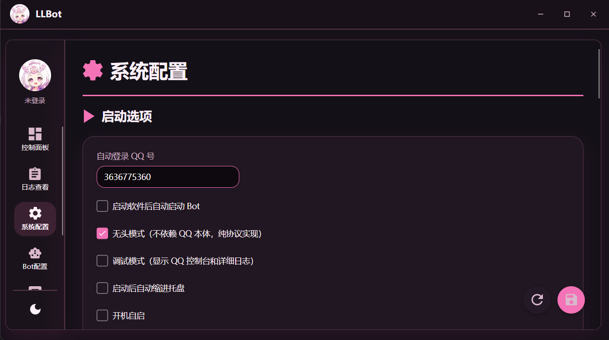
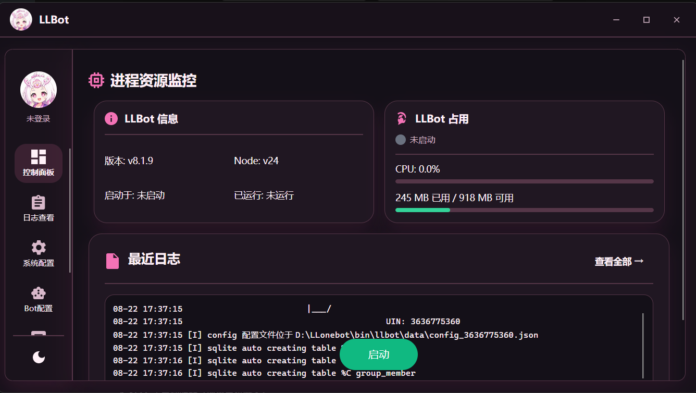
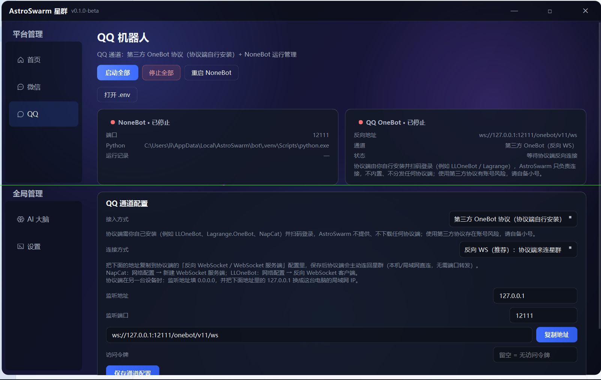
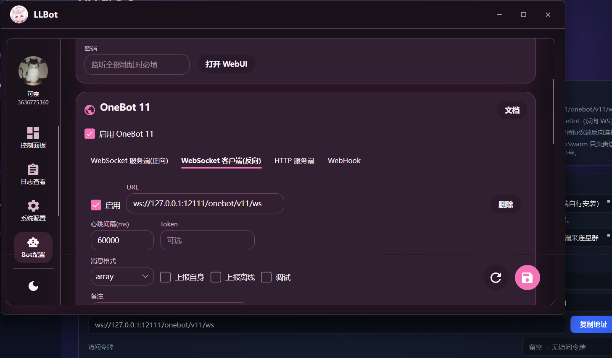

# LLOneBot 无头模式连接星群客户端（AstroSwarm）教程

> 适用：在 Windows 上用 LLOneBot（LLBot）无头模式登录 QQ 小号，通过反向 WebSocket
> 主动连接星群客户端，让星群里的 NoneBot / AI 大脑接管 QQ 机器人。
>
> 全程大约 5 分钟。协议端（LLOneBot）由你自己安装，星群不内置、不分发任何协议端；
> 第三方协议存在账号风险，请自备 QQ 小号。

## 重要声明（请先阅读）

1. **第三方 QQ 机器人违反腾讯用户协议**。LLOneBot 等第三方协议端属于未经腾讯授权的
   非官方登录方式，违反《腾讯服务协议》《QQ 软件许可及服务协议》等条款，账号存在被
   限制功能、冻结甚至封禁的风险。
2. **星群不提供内嵌式 QQ 通讯协议连接 agent**。星群（AstroSwarm）不内置、不提供、
   不分发任何 QQ 通讯协议层，也不通过 QQ 通讯协议直接连接 agent；星群只实现标准的
   OneBot v11 对接，协议端由用户自行下载安装、自行登录、自行维护。
3. **一切行为请用户自行承担**。因使用第三方协议产生的一切后果（账号封禁、数据风险、
   法律风险等）均由用户自行承担，星群不承担任何责任。
4. 强烈建议使用 QQ 小号进行测试，不要使用主号。

---

## 准备工作

1. 一台 Windows 电脑，已安装星群客户端（AstroSwarm）。
2. 一个 QQ 小号（建议不要用主号）。
3. 已下载 LLOneBot（LLBot）无头版并解压到本地目录。
4. **先去 LLOneBot 官网（https://llonebot.org）注册/登录账号，在个人中心找到你的
   Token 并复制保存**——LLBot 控制面板首次使用需要用它登录绑定，后面配置会用到。

---

## 第 1 步：配置 QQ 账号（并开启无头模式）

进入 LLBot 控制面板 →「系统配置 → 启动选项」：



上图中：

- **自动登录 QQ#**：填你的小号（如 `3636775360`）；
- **无头模式（不依赖 QQ 本体，纯协议实现）**：勾选；
- **启动软件后自动启动 Bot**：推荐勾选；
- 可选：启动后自动进托盘、开机自启；调试模式不用开。

---

## 第 2 步：启动 Bot，扫码登录并确认成功

回到控制面板启动 Bot，此时会出现 QQ 登录二维码，用 QQ 手机端扫码；登录成功后回到
控制面板确认：小号 UIN 已显示、配置文件已自动生成（说明登录成功）。



确认要点：

- 控制面板「LLBot 信息」里显示当前 QQ 小号 UIN（如 `3636775360`）；
- 配置文件已自动生成，路径形如
  `D:\LLonebot_bin\llbot\data\config-3636775360.json`；
- 此时确认登录成功后再进行下面的其他配置。

---

## 第 3 步：在星群客户端复制反向 WS 地址

打开星群客户端 → 「QQ 机器人」页，接入方式选 **第三方 OneBot（反向 WS，推荐）**，
点 **复制地址**：



复制到的地址长这样：

```
ws://127.0.0.1:12111/onebot/v11/ws
```

要点：

- **监听端口**默认 `12111`（跟随星群的 NoneBot 端口）；
- **访问令牌**：先留空（第 4 步也留空）；如果设置了令牌，第 4 步必须填同一个；
- 状态显示「等待协议端反向连接」是正常的，LLBot 连上后会变「已连接」；
- LLBot 和星群在同一台电脑时，地址里的 `127.0.0.1` 不用改。

---

## 第 4 步：在 LLBot 里添加反向 WebSocket 客户端

回到 LLBot 控制面板 → 「系统配置 → 网络配置（OneBot 11）」→ **WebSocket 客户端（反向）**，
点击添加/编辑：



按下表填写：

| 配置项 | 填写内容 |
|---|---|
| 启用 OneBot 11 | ✅ 开启 |
| WebSocket 客户端（反向） | ✅ 开启 |
| URL | `ws://127.0.0.1:12111/onebot/v11/ws`（第 3 步复制的地址） |
| 消息格式 | `array` |
| Token / 访问令牌 | 留空（与星群一致；星群设了令牌就填同一个） |
| 上报自身 / 上报离线 | 可选，建议开启 |

保存后，LLBot 会作为客户端主动连回星群，不需要端口转发。

---

## 第 5 步：回星群启动并验证

1. 回星群客户端点 **启动全部**（或仅启动 NoneBot）；
2. QQ 页状态从「等待协议端反向连接」变为「已连接 / 运行中」；
3. 到 QQ 群里 @ 机器人发一条「你好」，机器人回复即打通。

---

## 常见问题

- **端口被占用 / 连不上**：确认 LLBot 的 URL 端口和星群设置里的 NoneBot 端口一致（默认 12111），
  两个程序不要改得不一样。
- **令牌不一致**：星群「访问令牌」和 LLBot 的 Token 要么都留空，要么填同一个，否则会被拒绝连接。
- **无头模式下小号登录不上**：回「启动选项」确认自动登录 QQ# 填对，勾了无头模式后不需要开 QQ 本体；
  若之前用 QQ 本体登录过，确认小号没有被挤下线。
- **协议端在另一台电脑**：星群端「监听地址」改成 `0.0.0.0`，LLBot 的 URL 里把 `127.0.0.1`
  换成星群那台电脑的局域网 IP（如 `ws://192.168.1.10:12111/onebot/v11/ws`）。
- **封号风险**：第三方协议违反 QQ 用户协议，请使用小号，风险自担；星群只负责标准 OneBot 对接。
